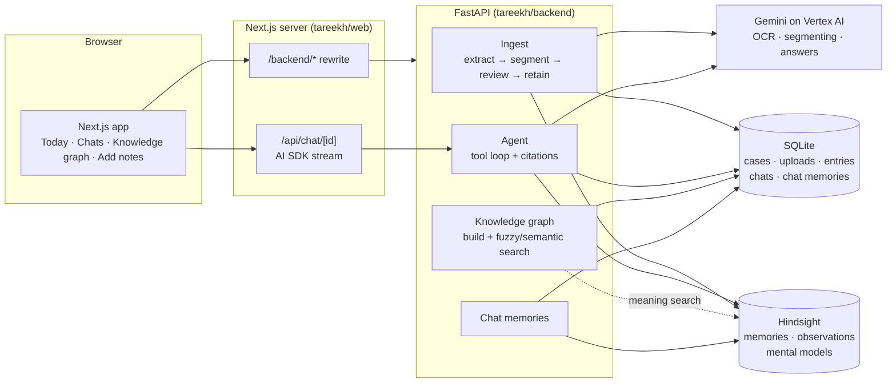
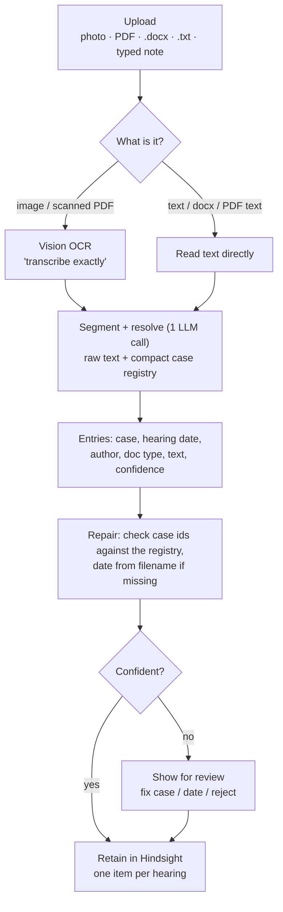
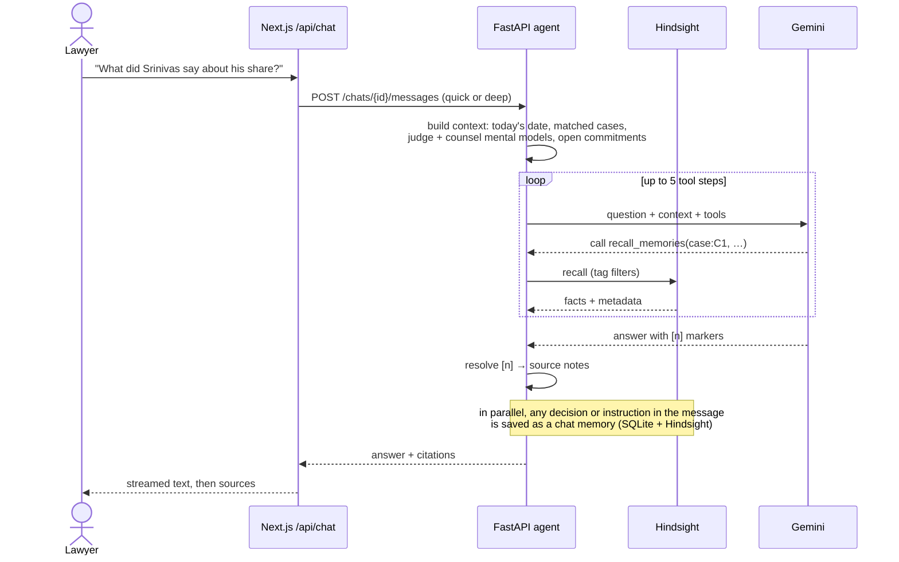
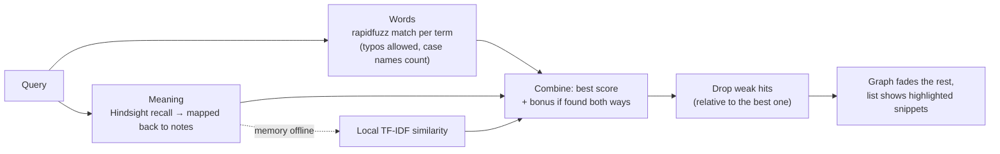

# Tareekh

**A practice memory for Indian litigators.** You give it what a lawyer already has (diary photos, typed notes, certified
order sheets, scanned documents), and it files every hearing under the right case, remembers it, and lets you ask
questions about it later with the source note cited.

Built on [Hindsight](https://hindsight.vectorize.io) for the *AI Agents That Learn Using Hindsight* hackathon.
"Tareekh" means *date*, as in the famous *tareekh pe tareekh*.


---

## Why I built this

My starting point was simple: in Indian district courts, a civil case can run for years over dozens of short hearings,
and almost everything about what happened at each hearing lives in paper. The advocate writes two lines in a pocket
diary, the junior types a longer note in the evening, and the court's own record is a certified copy of the order sheet
that arrives weeks later. None of it is searchable, and the useful connections are almost never in one document.

For example, in the demo data one party (Srinivas) claims **70%** of a piece of land in one suit, and a year later tells
a *different judge* in a *different suit* that he and his friend are **equal owners**. A lawyer who remembers both can
use it in cross-examination. That kind of cross-case recall is what I wanted a memory system to do.

Tareekh does not give legal advice. It only remembers, and it always shows where an answer came from.

---

## What it does

### Today: the cause list, with what happened last time

The home screen shows the day's listed matters. For each one you get the court hall, judge, case number, what it's
listed for, the opening line of the last note (with the full note one tap away), and anything you decided about that
case in a previous chat. **Brief me on …** opens a chat that goes through the matter; **Brief me on today's cause list**
does all of them in order.

| Light | Dark | Phone |
|---|---|---|
|  |  |  |

### Asking questions in chat

Each chat is a conversation with an agent that searches the memory before it answers. It has four tools:
`find_case`, `recall_memories` (fast, for "what/when" questions), `reflect_on_memories` (slower, for patterns across
cases) and `case_timeline`. Every sentence that comes from a note gets a `[n]` marker, and tapping it opens the source.

There's a **Quick / Deep** switch: Quick does one search and answers in a few seconds, Deep lets the agent use more
tools and look across cases (about 25 s).

If you tell it something in a chat, like *"we will not settle for Srinivas's half"*, it saves that as a separate kind of
memory (a decision, instruction, deadline or fact). These show up on the Today screen and inside the matching case card,
and they're always ranked below court records, because a chat is not evidence.

### Knowledge graph: search everything and read the original

This page shows every note, order sheet and document as one graph: each note is linked to its case, to the hearing before
it, and to notes in other cases that talk about the same things. A case's judge, opposing counsel and client hang off
it, so you can see when the same person shows up in more than one case.


You can search in three modes: **Words** (typo-tolerant, so "seabreze adjurnment" still works), **Meaning** (notes about
the same thing in different words) or **Both**. Everything irrelevant fades out, the view zooms to the matches, and
clicking one opens the actual photo or PDF next to the text that was read from it.

### Adding notes

Drop photos, PDFs, .docx or .txt files (or type a note). The backend reads them (OCR for photos), splits them into one
entry per hearing, guesses the case and date, and shows you anything it's unsure about before saving it to memory.


---

## It finds the answer (real examples)

The full pipeline runs for real: all 79 demo uploads went through Gemini OCR on Vertex AI, got split into hearings and
were retained in Hindsight. The screenshots below are real searches on that same demo data, but they were taken on a
copy running without API keys (see [Offline demo](#offline-demo-no-api-keys)), so the "Meaning" part used the local
similarity fallback instead of Hindsight. That's why the results say *offline match*. Nothing is staged.

**"What share does Srinivas claim?"** The first result is his written statement in the partition suit (*claims 70%
share*). The second is our cross-examination note where we put his deposition from the *other* suit to him (*"Ramesh and
I are EQUAL owners, 50-50"*). That contradiction is exactly the cross-case link I wanted it to surface.


**"Did Seabreeze start work before permissions?"** It goes straight to the note on the company's site manager, who said
"no work at all before permissions" in chief and then admitted to survey pegs and poles in cross. The original diary page
opens on the right.


**"Murthy sir adjournment costs"** finds the judge's pattern across three different cases, including the note where
Aditya wrote it down himself: *"His pattern: 2nd time 'last opportunity', 3rd time costs."*


On a phone the note opens as a sheet over the graph:


> Chat answers come from Gemini + Hindsight, so they need the full setup. The search above works on the same notes
> even without keys.

---

## Architecture

### The big picture



The split is deliberate. **SQLite** holds things that need exact lookups: which cases exist, their nicknames, uploads
and chats. **Hindsight** holds the memories themselves, and it's also where patterns form (it consolidates facts into
"observations" and keeps "mental models" per judge, per opposing counsel and for open commitments). The **Next.js**
app talks to FastAPI through a rewrite, except for chat, which goes through an AI SDK route so the answer can stream.

### Ingest: anything in, one memory per hearing out



A diary page that mentions three matters becomes three entries, and an order sheet with three dated rows becomes three.
Each retained item uses the **hearing date** as its timestamp (not the upload date), so "last time" means the last hearing.
Tags like `case:C3`, `judge:J1` and `counsel:OC2` are what recall filters on; metadata like the source file is what the UI
shows as the citation. The details are in [tareekh/ARCHITECTURE.md](tareekh/ARCHITECTURE.md).

### Asking a question



If the model's tool calling fails, the agent falls back to a fixed path (resolve the case, one recall, one completion) and
the response says which mode it used, so the chat never just errors out in court.

### Knowledge graph search



The graph itself is built from SQLite in about 30 ms and cached until notes change. "Same topic" links come from a local
TF-IDF comparison (each note linked to its two closest notes). The frontend renders it with **Sigma.js** (WebGL) and lays
it out with **ForceAtlas2** in a web worker, so it stays smooth even with a few thousand notes.

---

## Tech stack

| Part | What I used | Why |
|---|---|---|
| Memory | Hindsight (local Docker) | recall + reflect + observations + mental models, one bank per lawyer |
| Models | Gemini on Vertex AI (OpenAI-compatible client) | OCR, segmenting and answers; Groq's free tier was too rate-limited |
| Backend | FastAPI, SQLite, rapidfuzz, pypdf, python-docx | Hindsight's client is Python, and so is the data generator |
| Frontend | Next.js 16, React 19, Tailwind 4 | App Router, and the AI SDK for streaming chat |
| Chat UI | assistant-ui + Vercel AI SDK | real thread, composer and message parts instead of building my own |
| Graph | Sigma.js, graphology, ForceAtlas2 | WebGL rendering and reducers for the fade-on-search effect |
| UI bits | shadcn/ui, a few [React Bits](https://reactbits.dev) components, motion | segmented toggles, hold-to-forget, swipeable toasts, upload status marks |
| Type | Anek Latin (Ek Type), Eczar (Rosetta), Martian Mono, Samarkan for the wordmark | Indian foundries; the wordmark is the only Samarkan text |

---

## Running it

### Full setup (with memory and models)

Needs Python 3.10+, Node 20+, Docker Desktop, and a Google Cloud project with Vertex AI
(`gcloud auth application-default login` once).

```powershell
# 1. backend + Hindsight
cd tareekh\backend
copy .env.example .env                                   # set VERTEX_PROJECT
powershell -ExecutionPolicy Bypass -File start.ps1       # starts Hindsight, the API on :8000, onboards the demo cases
.venv\Scripts\python scripts\load_backlog.py            # (another terminal) sends the 79 demo uploads through OCR + memory

# 2. web app
cd ..\web
npm install
npm run dev                                              # http://localhost:3000
```

Sign in with one of the two demo accounts (it's a simulated sign-in; nothing is checked). Hindsight's own UI is at
`http://localhost:9999` if you want to look at the memory bank directly.

### Offline demo (no API keys)

For trying the UI without a Google Cloud project; the README screenshots were taken this way. It skips OCR and
Hindsight and loads the demo backlog's text and original files straight into SQLite:

```bash
cd tareekh/backend
pip install -r requirements.txt
python scripts/seed_local.py
HINDSIGHT_URL=http://127.0.0.1:9 uvicorn app.main:app --port 8000   # memory "offline" on purpose

cd ../web && npm install && npm run dev
```

Today, Add notes (the review screens), the knowledge graph and its search all work. Chat needs the full setup.

### Tests

```bash
cd tareekh/backend && python -m pytest -q        # 22 tests, no API keys needed
cd tareekh/web && npx tsc --noEmit && npx oxlint
```

---

## The demo practice

Adv. **Aditya Varma** and his junior **Divya**, in Visakhapatnam. Two judges with opposite habits: **Murthy sir**
(strict, puts costs on repeated adjournments) and **Padmavathi madam** (patient, sends friends to mediation). Five cases,
three of which share one piece of land, one company and one witness, so there's something real for cross-case memory to
find.

| Case | What it's about | Judge |
|---|---|---|
| C1 O.S. 214/2024 | Ramesh vs Srinivas: two old friends fight over shares in 4.20 acres near Bheemili beach | Padmavathi |
| C2 O.S. 57/2025 | Seabreeze Resorts sues to enforce a sale agreement only Srinivas signed | Murthy |
| C3 O.S. 131/2025 | Ramesh sues Seabreeze to stop them fencing the land | Murthy |
| C4 O.S. 302/2025 | Landlady vs tiffin-centre tenant (eviction) | Padmavathi |
| C5 O.S. 88/2025 | Printer vs school (unpaid bills) | Murthy |

The data is 50 hearings turned into 79 uploads: diary photos, typed notes, order-sheet scans, a sale deed, the Seabreeze
agreement with Ramesh's signature column left blank, a WhatsApp export and so on. It's all generated from one
hand-written story in `tareekh-data/generator/story.py`, and `render.py` adds a phone-camera look (lens distortion,
vignetting, noise, the odd blurry shot) so OCR gets tested on something closer to real photos.

---

## Project layout

```
tareekh/
  backend/            FastAPI app
    app/ingest/         extract → segment → repair → retain
    app/agent/          context builder + tool loop + citations
    app/graph.py        knowledge graph + fuzzy/semantic search
    app/chatmem.py      decisions/instructions remembered from chats
    scripts/            start_hindsight.sh, load_backlog.py, seed_local.py
    tests/
  web/                Next.js app
    app/(app)/          Today, chat, knowledge graph, Add notes
    app/login/          simulated sign-in
    app/brand/          brand guide (logo, colours, type)
    components/bits/    React Bits components, adapted to the theme
    lib/cache.ts        stale-while-revalidate cache for backend reads
  ARCHITECTURE.md     the backend in more detail
tareekh-data/         generator/ (story.py, build.py, render.py), data/ (ground truth), uploads/ (what gets uploaded)
docs/                 DEVLOG.md, GLOSSARY.md, images/ (the screenshots in this README)
```

---

## Things that were harder than I expected

- **Cross-case patterns didn't form at first.** Hindsight consolidates observations per tag set by default, and every note
  has a different tag set, so "Murthy sir puts costs on the third adjournment" never showed up. Setting explicit
  `observation_scopes` per judge, counsel and case fixed it.
- **Dates.** If a memory's timestamp is the upload time, "what happened last time" is wrong for any backlog. Everything is
  stamped with the hearing date instead, and `document_id` makes re-uploading the same file replace rather than duplicate.
- **OCR mistakes become confident memories.** A wrongly read date turns into a wrong fact the agent will happily cite.
  That's why low-confidence entries go through a review screen before they're saved.
- **Rate limits.** I started on Groq's free tier and Hindsight could only store about two memories a minute. Moving to
  Gemini on Vertex AI fixed it.
- **The graph got tangled.** I tried a clustered layout with a link filter, but the round layout looked better with this
  much data, so I went back to it. With a lot more notes the filter would be worth bringing back.

## What I'd do next

- Real sign-in (it's simulated right now), and one memory bank per lawyer on a server instead of my laptop.
- Generate a proper one-line summary for each note when it's saved, instead of using its first sentence.
- Import the court's own cause list each morning instead of relying on "next date" from the notes.
- Offline support on the phone, since court halls often have no signal.

---

## Credits

- [Hindsight](https://hindsight.vectorize.io) by Vectorize, for the memory layer.
- [React Bits](https://reactbits.dev) by David Haz (MIT + Commons Clause), for a few UI components.
- [assistant-ui](https://github.com/assistant-ui/assistant-ui), [Sigma.js](https://www.sigmajs.org/) and graphology.
- Fonts: Anek Latin (Ek Type), Eczar (Rosetta), Martian Mono. The wordmark uses Samarkan (Titivillus Foundry), which is
  shareware and needs a licence before any public or commercial release.

More notes on how this changed over time are in [docs/DEVLOG.md](docs/DEVLOG.md).
