# Tareekh

**A practice memory for Indian litigators.** You give it what a lawyer already has (diary photos, typed notes, certified
order sheets, scanned documents), and it files every hearing under the right case, remembers it, and lets you ask
questions about it later with the source note cited.

Built on [Hindsight](https://hindsight.vectorize.io) for the *AI Agents That Learn Using Hindsight* hackathon.
"Tareekh" means *date*, as in the famous *tareekh pe tareekh*.

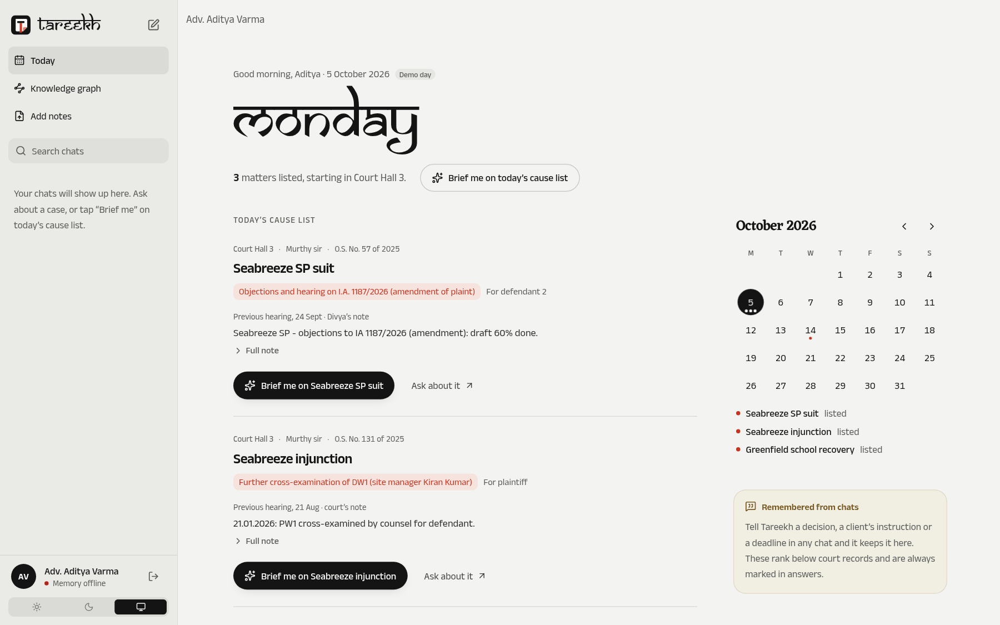

---

## Why we built this

Our starting point was simple: in Indian district courts, a civil case can run for years over dozens of short hearings,
and almost everything about what happened at each hearing lives in paper. The advocate writes two lines in a pocket
diary, the junior types a longer note in the evening, and the court's own record is a certified copy of the order sheet
that arrives weeks later. None of it is searchable, and the useful connections are almost never in one document.

For example, in the demo data one party (Srinivas) claims **70%** of a piece of land in one suit, and a year later tells
a *different judge* in a *different suit* that he and his friend are **equal owners**. A lawyer who remembers both can
use it in cross-examination. That kind of cross-case recall is what we wanted a memory system to do.

Tareekh does not give legal advice. It only remembers, and it always shows where an answer came from.

---

## What it does

### Today: the cause list, with what happened last time

The home screen shows the day's listed matters. For each one you get the court hall, judge, case number, what it's
listed for, the opening line of the last note (with the full note one tap away), and anything you decided about that
case in a previous chat. **Brief me on …** opens a chat that goes through the matter; **Brief me on today's cause list**
does all of them in order.

| Light | Dark | Phone |
|---|---|---|
|  | 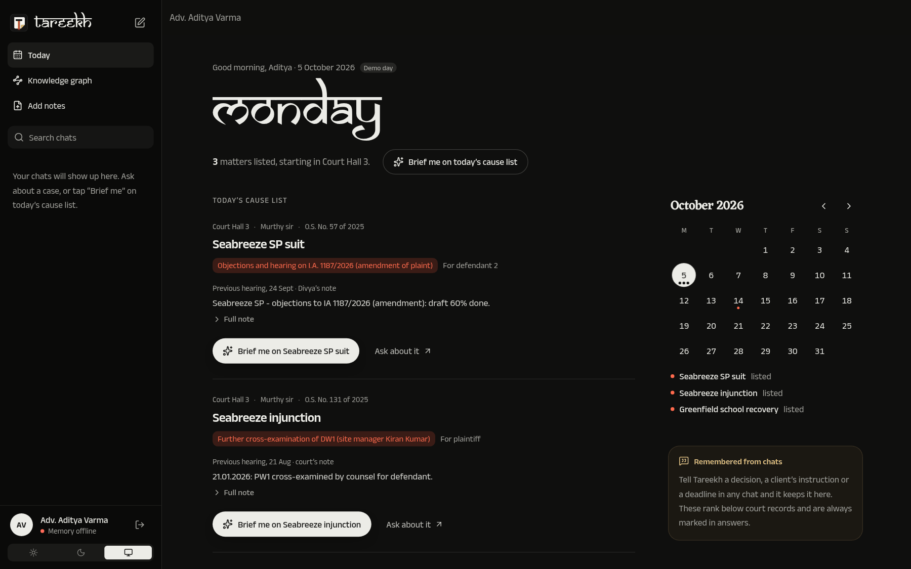 | 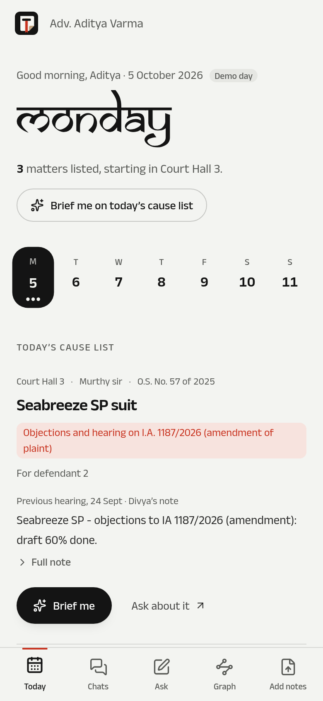 |

### Asking questions in chat

Each chat is a conversation with an agent that searches the memory before it answers. It has four tools:
`find_case`, `recall_memories` (fast, for "what/when" questions), `reflect_on_memories` (slower, for patterns across
cases) and `case_timeline`. Every sentence that comes from a note gets a `[n]` marker, and tapping it opens the source.

There's a **Quick / Deep** switch: Quick does one search and answers in a few seconds, Deep lets the agent use more
tools and look across cases (about 25 s).

The whole conversation goes with every question, so follow-ups work however long the chat gets. A small ring in the
top bar shows how full the chat's context is; when it nears the limit, older messages are summarised automatically (or
tap **Compress now**). How that works is [below](#how-the-agent-answers-a-question).

If you tell it something in a chat, like *"we will not settle for Srinivas's half"*, it saves that as a separate kind of
memory (a decision, instruction, deadline or fact). These show up on the Today screen and inside the matching case card,
and they're always ranked below court records, because a chat is not evidence.

### Voice mode

Tap the voice button in any chat and just ask. Tareekh listens until you pause, then answers aloud in a calm British
voice, and listens again: one turn at a time, with an **Exit** button (or Esc) to go back. The questions and answers
land in the chat like typed ones, with their sources. How it works, and how we got it fast, is
[below](#voice-mode-turn-by-turn).

### Knowledge graph: search everything and read the original

This page shows every note, order sheet and document as one graph: each note is linked to its case, to the hearing before
it, and to notes in other cases that talk about the same things. A case's judge, opposing counsel and client hang off
it, so you can see when the same person shows up in more than one case.

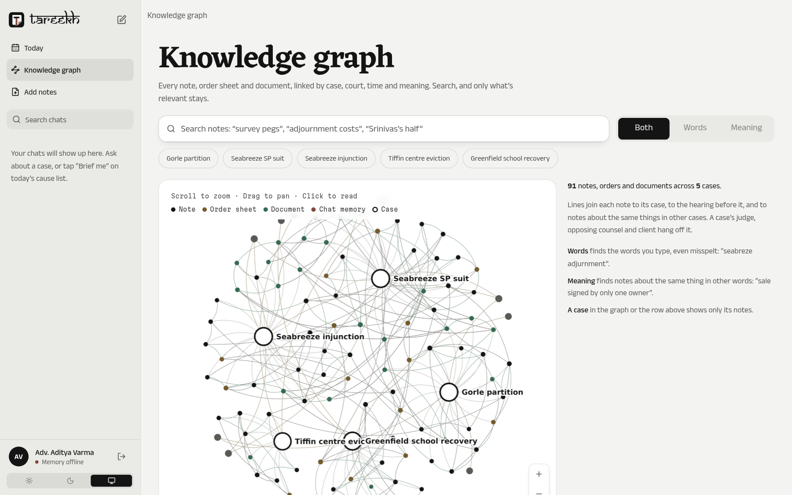

You can search in three modes: **Words** (typo-tolerant, so "seabreze adjurnment" still works), **Meaning** (notes about
the same thing in different words) or **Both**. Everything irrelevant fades out, the view zooms to the matches, and
clicking one opens the actual photo or PDF next to the text that was read from it.

### Adding notes

Drop photos, PDFs, .docx or .txt files (or type a note). The backend reads them (OCR for photos), splits them into one
entry per hearing, guesses the case and date, and shows you anything it's unsure about before saving it to memory.

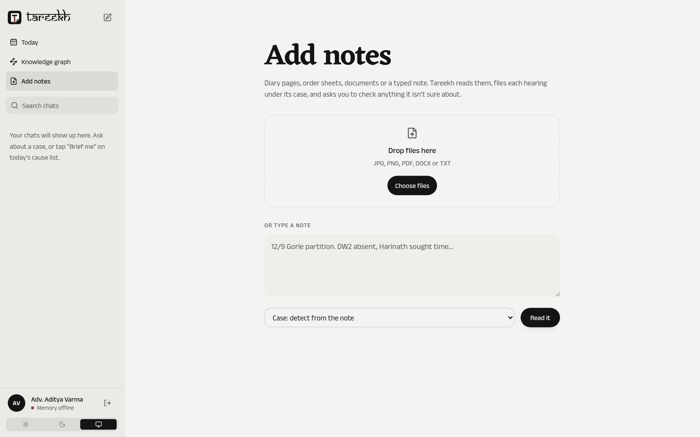

---

## It finds the answer (real examples)

These are real searches on the demo data, run on one of our laptops with memory offline. Nothing is staged. The "Meaning" part
falls back to a local similarity match when Hindsight isn't reachable, which is why the results say *offline match*.

**"What share does Srinivas claim?"** The first result is his written statement in the partition suit (*claims 70%
share*). The second is our cross-examination note where we put his deposition from the *other* suit to him (*"Ramesh and
I are EQUAL owners, 50-50"*). That contradiction is exactly the cross-case link we wanted it to surface.

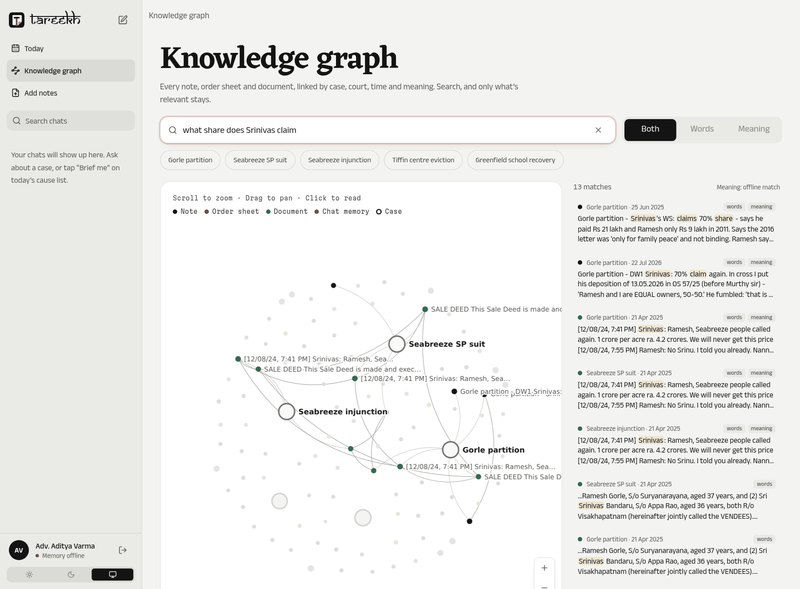

**"Did Seabreeze start work before permissions?"** It goes straight to the note on the company's site manager, who said
"no work at all before permissions" in chief and then admitted to survey pegs and poles in cross. The original diary page
opens on the right.

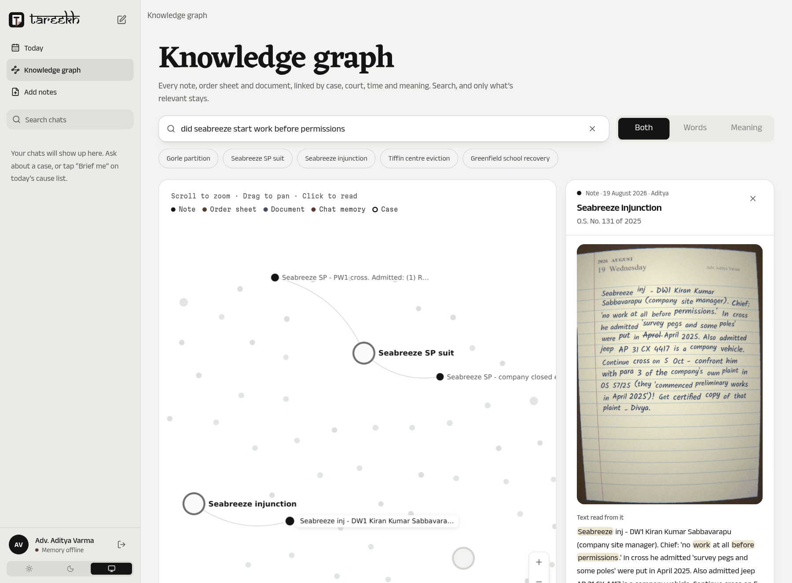

**"Murthy sir adjournment costs"** finds the judge's pattern across three different cases, including the note where
Aditya wrote it down himself: *"His pattern: 2nd time 'last opportunity', 3rd time costs."*

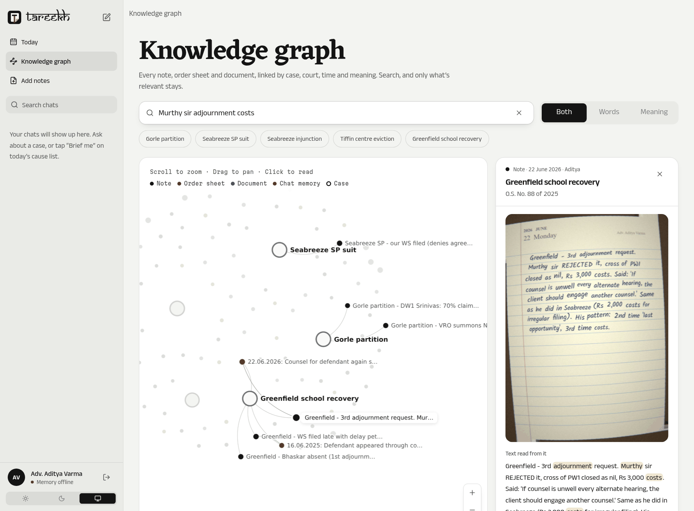

On a phone the note opens as a sheet over the graph:

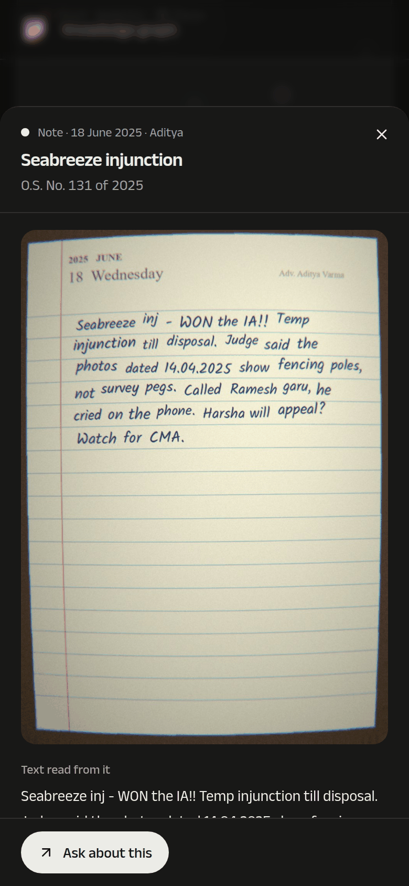

> The chat answers themselves come from Gemini + Hindsight, so they need API keys and aren't shown here as screenshots.
> The search above uses the same stored notes and runs without any keys.

---

## Architecture

### The big picture

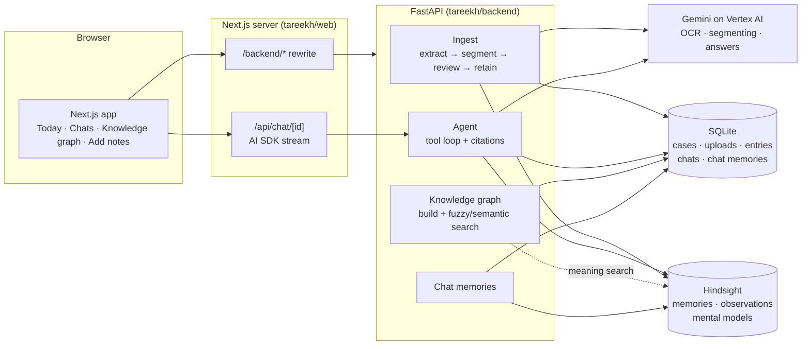

The split is deliberate. **SQLite** holds things that need exact lookups: which cases exist, their nicknames, uploads
and chats. **Hindsight** holds the memories themselves, and it's also where patterns form (it consolidates facts into
"observations" and keeps "mental models" per judge, per opposing counsel and for open commitments). The **Next.js**
app talks to FastAPI through a rewrite, except for chat, which goes through an AI SDK route so the answer can stream.

### Ingest: anything in, one memory per hearing out

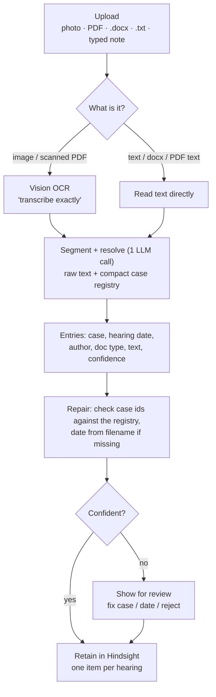

A diary page that mentions three matters becomes three entries, and an order sheet with three dated rows becomes three.
Each retained item uses the **hearing date** as its timestamp (not the upload date), so "last time" means the last hearing.
Tags like `case:C3`, `judge:J1` and `counsel:OC2` are what recall filters on; metadata like the source file is what the UI
shows as the citation. The details are in [tareekh/ARCHITECTURE.md](tareekh/ARCHITECTURE.md).

### How the agent answers a question

This is the part that matters most, so here it is step by step. The code is in
[`tareekh/backend/app/agent/`](tareekh/backend/app/agent/) (`context.py` and `agent.py`, about 220 lines together).

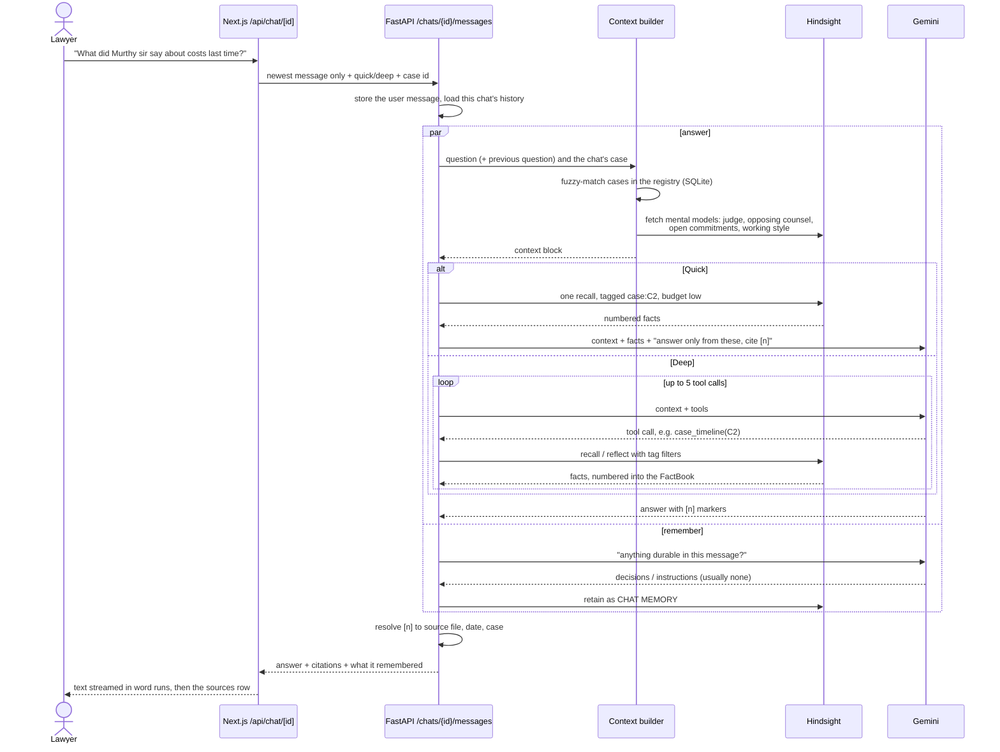

**1. The browser sends only the newest message.** The chat UI (assistant-ui on top of the AI SDK's `useChat`) would
normally post the whole thread. FastAPI already has the history in SQLite, so `prepareSendMessagesRequest` trims it to
the last message and adds the Quick/Deep setting and the chat's case. The Next.js route calls FastAPI, then streams the
finished answer back in three-word runs so it reads in, followed by a `data-sources` part with the citations.

**2. The context builder runs before any model call, and it's plain code.** It decides what the agent knows *before* it
searches:

- `TODAY` (2026-10-05 in the demo), so "last time", "overdue" and "next week" have something to anchor to.
- **Which case the question is about.** The chat's own case comes first, then `rapidfuzz` matches against every case's
  number, nickname and party names (`registry.find_cases`). "Seabreeze", "OS 57/25" and "Gorle" all resolve. A
  follow-up like *"and what did he say about costs?"* is matched together with the previous question, so it inherits
  the case. If neither question names a case, the previous *answer* is matched instead ("was the samadhi ever
  affected?"). A case found that way is only context, so Quick searches the whole bank rather than filtering on a
  guess. At most two cases go in.
- **The registry row for each case**: number, title, which side we're on, court hall, judge and opposing counsel with
  their ids, client and stage.
- **What Hindsight has learned**, as mental models: the profile of that case's judge, the profile of the opposing
  counsel, the open commitments list and how Aditya works. Nobody types these in. Hindsight writes them from the notes
  and refreshes them after each consolidation (more on that below). Each is clipped to about 1,800 characters.

**3. Quick or Deep.**

| | Quick (the default) | Deep |
|---|---|---|
| Searches | one `recall`, filtered to the matched case, `budget="low"` | the model picks tools, up to 5 calls |
| Model calls | 1, with thinking set to low | 2 to 6, full thinking |
| Time | about 3 to 7 s | about 15 to 30 s |
| Good for | "when is the next date", "who is opposing counsel", standing in court | "what should I expect from Murthy sir", anything across cases |

Quick is fast because it skips tool calling entirely: recall the facts, put them in the prompt, ask for one answer.
The trade-off is that one low-budget search can miss things. In testing, Quick once called 15 Jul 2026 the "last
hearing" where Deep, which pulled the whole timeline, correctly said 2 Sep 2026. It names the date it means, so you can
tell.

**4. The tools (Deep mode).**

| Tool | What it does | Backed by |
|---|---|---|
| `find_case(text)` | nickname, party or number to case ids | rapidfuzz over the SQLite registry |
| `recall_memories(query, case_id?, judge_id?, counsel_id?)` | fast fact lookup | Hindsight `recall`, filtered by tags |
| `reflect_on_memories(query, …same filters)` | reasons across many memories to find a pattern | Hindsight `reflect` |
| `case_timeline(case_id)` | everything on one case, oldest first | a large `recall` (5,000 tokens) on `case:<id>`, sorted by hearing date |

Filters become tags: `case_id="C2"` is `case:C2`, `judge_id="J1"` is `judge:J1`. That's how "how does Murthy sir treat
adjournments?" searches every case before him, not just one.

**5. The FactBook: how `[3]` becomes a source.** Every fact any tool returns goes into one numbered list for the whole
turn. A fact seen twice keeps its first number. Each line the model sees looks like

```
[3] (2025-07-09; C2; IMG_20250709_192051.jpg) Judge Murthy refused to receive 14 documents without a list...
```

Chat memories are sorted to the bottom and labelled `CHAT MEMORY;`. When the answer comes back, a regex pulls out every
`[n]` and `[n, m]`, and each number is mapped back to the fact's metadata: source file, hearing date, case, document
type. That's what the sources sheet shows, and the original photo or PDF opens from there. A number the model made up
(higher than the list) is dropped.

**6. The rules in the system prompt** (`SYSTEM` in `agent.py`), in short:

- Answer from the memory bank only; never give legal advice.
- Use the context to *aim* searches, but every fact in the answer must come from a tool result, with a `[n]`.
- Keep the court's order sheet apart from what only Aditya's or Divya's notes say.
- Chat memories rank below records. If they conflict, the record wins and the answer says so.
- Lead with the closest thing memory *does* have. Say "no record" only when nothing bears on the question. "Last time"
  means the most recent dated hearing, named by date.
- Be brief: he may be standing in court.

The same rules live in Hindsight as **directives** (cite sources, no legal advice, admit gaps, official vs personal), so
`reflect` follows them too.

**7. Remembering, in parallel.** While the answer is being written, a second thread asks Gemini whether the lawyer's
message contains anything durable: a decision, plan, instruction, deadline or preference *he* stated. Most messages
contain nothing. When something is found (*"we will not settle for Srinivas's half"*), it's stored in Hindsight as a
`CHAT MEMORY (said by Aditya in a chat, not a court record)` with the case's tags, and in SQLite so it can be listed and
forgotten. Forgetting deletes the Hindsight document too, so it can't come back in a later answer. It costs no extra
wait because it overlaps the answer.

**8. It never just errors in court.** Gemini 3's function calling needs its "thought signatures" sent back on every
turn, so the assistant message is returned verbatim (`model_dump`). If anything in the tool loop still fails, the agent
falls back to the Quick path and records `mode: "fallback"`. If Hindsight or the model is down entirely, the chat shows
the error instead of an empty answer. A blank reply from the model is treated as a failure too (it happened when the
model spent all five steps searching with a case *number* where a case *id* belonged; tool arguments are now resolved
through the registry). Retrying a question replaces the failed turn instead of storing the question twice.

**9. The whole thread goes with every question, and it's compressed when it gets long**
([`threadctx.py`](tareekh/backend/app/threadctx.py)). Earlier versions sent only the last six messages, cut to 2,000
characters each, so a long chat quietly forgot its beginning. Now every message in the thread is carried word for
word, up to a budget (`CHAT_CONTEXT_TOKENS`, 24,000 tokens by default):

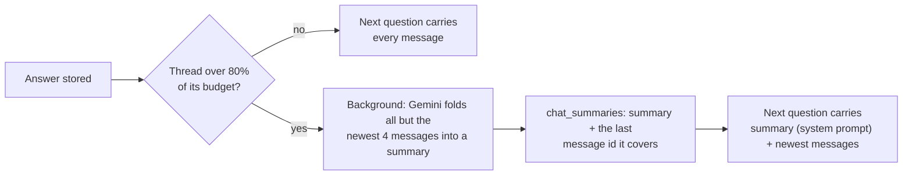

- **Counting.** Tokens are counted with [tiktoken](https://github.com/openai/tiktoken) (`o200k_base`). It isn't
  Gemini's tokenizer, but it tracks it closely enough for a budget, runs locally and costs nothing. After each answer
  the meter also shows the *real* prompt size Gemini reported (`usage.prompt_tokens`, the largest call in the turn)
  against the model's 1M window.
- **Compressing.** Past 80%, a background thread asks Gemini for a briefing of everything except the newest four
  messages: first the lawyer's questions in order, then case numbers, names, dates, amounts, decisions and open
  questions, kept exactly. A later compression merges the previous summary in, so it rolls forward. The summary goes
  into the system prompt as `<earlier_in_this_chat>`; the newest messages stay as real messages. The original messages
  are never deleted, only no longer sent.
- **Safety.** The next question waits for a running compression to finish (a per-chat lock), so it never reads a
  half-written thread. If the summary comes back empty, the full thread is kept. Old answers' `[n]` markers are
  stripped before they're sent again, because those numbers pointed at a different turn's facts.
- **In the UI.** A ring in the chat's top bar shows how full the thread is and turns red past 80%. Tapping it opens the
  breakdown (summary vs word-for-word messages, the last real request against the model's window), the summary itself,
  and **Compress now**.

We chose a summary written by the same model over a prompt-compression library such as LLMLingua. LLMLingua needs
PyTorch and a local model, which is heavy for a laptop that already runs Hindsight. It also drops tokens by
perplexity, which can cut exactly the dates and I.A. numbers a lawyer needs.

#### A worked example, and a bug it exposed

*"What did Murthy sir say about costs last time?"*, asked in the Seabreeze SP suit chat. The context builder resolves
the chat's case (C2) and loads Murthy sir's learned profile. Recall on `case:C2` returns thirteen facts, including the
order of **9 Jul 2025** (₹2,000 costs for producing 14 documents without a list), the note of **3 Sep 2025** (costs
paid by DD), and a consolidated observation that he gives "last opportunity" warnings before closing evidence.

An earlier version answered:

> Memory has no record of Judge Murthy saying anything about costs last time. The only references to costs in the
> record are: on 09 Jul 2025, he imposed ₹2,000 costs…

It denied the fact and then cited it. Retrieval was fine; the wording rule was the problem. The model read "last time"
as *the most recent hearing*, where nothing about costs was recorded. The prompt told it to "say plainly when memory
has nothing", so it opened with a denial and then listed what it had actually found. The rule now says to lead with the
closest fact, name the hearing "last time" refers to, and never deny something it goes on to cite. The same question
now gets:

> Nothing on costs was recorded at the last hearing (2 Sep 2026); he last imposed costs in this suit on 9 Jul 2025 […]

A question with genuinely nothing behind it (*"Did Murthy sir ever send the parties to mediation?"*) still gets a plain
"no record", followed by what did happen in the case.

### Voice mode, turn by turn

Voice is turn-based on purpose: you speak, pause, and Tareekh answers aloud; then it listens again. Nobody interrupts
anybody, and while she speaks the microphone isn't recording. Everything runs on Vertex AI.

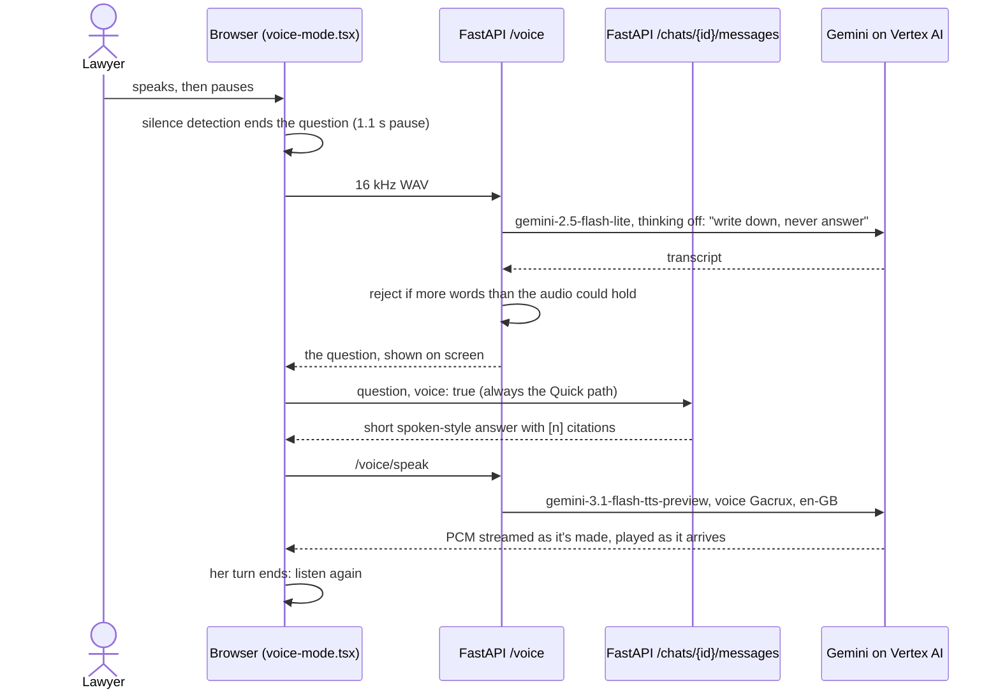

- **The voice.** Gemini TTS's "Gacrux" voice (Google describes it as *mature*) in British English, with a style
  prompt for a calm, wise, older British woman. We checked the style prompt isn't read aloud by having Gemini
  transcribe the audio it produced. `gemini-2.5-flash-tts` is the fallback if the preview model refuses.
- **Streaming.** The first audio arrives about 1.2 s after the request. The backend passes Gemini's PCM chunks straight
  through, and the browser schedules them back to back with the Web Audio API.
- **Transcription must never invent.** Our first prompt gave the transcriber the case list as a spelling aid. On an
  answerable question it answered instead of transcribing, and made up a date. Now it gets names only, a system rule
  to write the question down and never answer it, and a check in code: a "transcript" with more words than the
  recording could hold (over 4.5 words a second) is rejected, and Tareekh asks you to repeat yourself. The fabricated
  line from that test is now a regression test.
- **The visual is the Tareekh mark.** The diary leaf, turned corner and red ribbon from the logo each have a job:
  ruled lines appear and ripple with your voice while it listens, the corner lifts and settles while it thinks (the
  diary being leafed through), and the red tape runs past the tile and moves with her voice while she speaks. Plain SVG
  on one animation loop, with a calm version under Reduce Motion.

Where the time goes (one turn, measured in the browser):

| Step | Before tuning | Now |
|---|---|---|
| Noticing you've finished | 1.4 s pause | 1.1 s pause |
| Transcription | 1.9 to 6.5 s (one call stalled at 46 s) | 1.5 to 2 s |
| The answer | 13 to 26 s | 2.4 s warm, about 7 s on a cold server |
| First sound of her voice | 1.4 to 1.7 s | 1.2 s |

The biggest wins: the model's thinking set to `low` on the Quick path (same facts and citations in our comparison),
voice always taking Quick, the answer no longer waiting for the "anything to remember?" check (that check took 9 to
15 s), thinking switched off for transcription, one kept-alive connection to Vertex, and warming that connection while
the microphone opens.

### Retrieval: how memories are stored and found

All the searching happens in [Hindsight](https://hindsight.vectorize.io), running locally in Docker with one memory bank
for the practice. Tareekh's job is to put things in so they can be found again, and to ask the right way.

#### Storing: one item per hearing

Ingest turns every upload into entries (one per case per hearing date), and each confirmed entry becomes one Hindsight
item (`build_item` in [`memory.py`](tareekh/backend/app/memory.py)):

```python
{
  "content":   "[2025-07-09] O.S. No. 57 of 2025 (Seabreeze SP suit; ...) before Sri P. Suryanarayana Murthy; "
               "opposing counsel Sri V. Harsha Vardhan; client Ramesh Gorle. Source: order sheet by court.\n<text>",
  "timestamp": "2025-07-09T10:30:00+05:30",     # the hearing date, never the upload time
  "tags":      ["case:C2", "judge:J1", "counsel:OC2", "client:CL1", "type:order_sheet", "author:court"],
  "metadata":  {"source_file": "...", "upload_id": "...", "case_id": "C2", "hearing_date": "2025-07-09", ...},
  "document_id": "<upload_id>:C2:2025-07-09",   # uploading the same file again replaces, never duplicates
  "observation_scopes": [["judge:J1"], ["counsel:OC2"], ["case:C2"]],
}
```

Each field has one job:

- The **header line** puts the case number, nickname, judge and counsel into the text itself, so a note that only says
  "Seabreeze inj - DW1 cross" can still be found by searching for the judge.
- The **timestamp** is the hearing date. Otherwise "last time" would mean "the last thing I uploaded", which is wrong
  for a backlog.
- **Tags filter, metadata cites.** Hindsight can filter recall by tags but not by metadata. Metadata comes back with
  each fact, and that's what the UI shows as the source.
- **`observation_scopes`** is what lets cross-case patterns form (see below).

Hindsight then does its own work on each item. An LLM pass, guided by the bank's **retain mission** (keep dates,
amounts, exhibit numbers and quotes verbatim; record adjournments, who sought them and why; costs; undertakings),
splits it into individual facts, pulls out entities (people, companies, the land) and links them.

#### Finding: what one `recall` call does

A recall runs four searches in parallel over those facts and merges them:

| Strategy | Finds | Example it helps with |
|---|---|---|
| Semantic (vector similarity) | the same idea in different words | "sale signed by only one owner" finds the agreement Ramesh never signed |
| Keyword (BM25) | exact terms | "I.A. 1187", "Ex.B3", "₹2,000" |
| Entity graph | facts linked through the same person, company or place | Srinivas's statements in two different suits |
| Temporal | facts in a time window | "last hearing", "in July" |

The lists are fused with reciprocal rank fusion, and the top candidates are re-scored by a cross-encoder that reads the
question and each fact together. What comes back is facts, not documents, each with a type:

- **world**: a fact taken from a note ("DW1 admitted survey pegs were placed in April 2025").
- **observation**: a belief Hindsight consolidated from several facts, with its evidence ("Murthy sir gives a 'last
  opportunity' warning on the second adjournment and costs on the third; seen in C2, C3 and C5").

Tareekh sets three knobs: **tags** (`case:C2`, matched with `any`), **max_tokens** (how much comes back: 2,000 for
Quick, 5,000 for a timeline) and **budget** (`low` for Quick and graph search, `mid` otherwise), which controls how many
candidates each strategy gathers before reranking.

#### Learning: observations, mental models and reflect

This is the "learns over time" part, and it happens in the background after every retain.

- **Consolidation** folds new facts into **observations**. By default Hindsight consolidates per *full tag set*, and
  every note has a different one, so "Murthy sir puts costs on the third adjournment" never formed. Giving each item
  explicit scopes (per judge, per counsel, per case) fixed that: all of Murthy sir's hearings, across his three cases,
  now consolidate together. The bank's **observations mission** says which patterns to track (judges' habits,
  counsel's adjournment reasons, the lawyer's routines) and asks it to count occurrences and name the cases.
- **Mental models** are standing questions that Hindsight answers from those observations and re-answers after each
  consolidation: one per judge, one per opposing counsel, *Open commitments* and *How Aditya works*
  ([`bank_setup.py`](tareekh/backend/app/bank_setup.py)). Nobody typed in the judges' habits. Onboarding deliberately
  leaves them out, so they have to be learned from the notes. The Today page and the context builder both read these.
- **Reflect** is the slow, reasoning version of recall, used by the `reflect_on_memories` tool. Hindsight runs its own
  small agent over mental models first, then observations, then raw facts, and writes an answer with the facts it used.
  The bank's dispositions are set sceptical and literal (4 of 5) and not very empathetic (2 of 5), which is what you
  want from a court record.

One lesson from the commitments model: it was asked "what is still open, and is it overdue?" but never told what day it
was, so it marked a 30 Sept filing deadline as "not overdue" on 5 Oct. The question now starts with today's date, and
setup updates existing models and directives when their wording changes.

#### Search on the knowledge graph

The graph page has its own search ([`graph.py`](tareekh/backend/app/graph.py)), because there you want *notes* to read,
not facts to cite. It runs two searches and combines them:

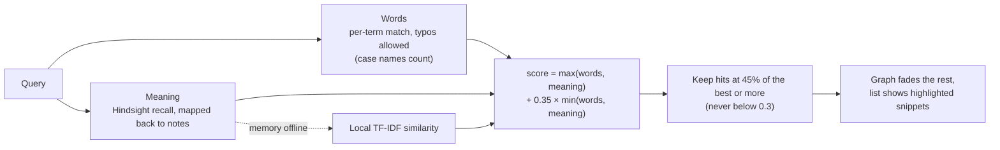

- **Words**: each query word must match a word in the note. An exact match scores 1. Otherwise `rapidfuzz` looks for a
  near spelling (80% similar for longer words, 90% for short ones) among words that *start with the same letter*, so
  "seabreze" and "adjurnment" work but "beach" doesn't match "each". A word of four or more letters also matches as a
  prefix. The whole phrase appearing verbatim adds a bonus, and a query that names a case pulls in that case's notes.
- **Meaning**: one `recall` with `budget="low"`. Each fact carries the `document_id` of the entry it came from
  (`upload:case:date`), which maps it back to a note, and earlier ranks score higher. If Hindsight isn't running, a
  local TF-IDF cosine similarity takes over, which is how the screenshots above were made.
- A note found **both** ways gets a bonus, so the top results are on topic *and* use your words.

The graph's "same topic" links use the same TF-IDF: each note is linked to its two most similar notes. The graph is
built from SQLite in about 30 ms and cached until notes change. The frontend draws it with Sigma.js (WebGL) and lays it
out with ForceAtlas2 in a web worker.

---

## Tech stack

| Part | What we used | Why |
|---|---|---|
| Memory | Hindsight (local Docker) | recall + reflect + observations + mental models, one bank per lawyer |
| Models | Gemini on Vertex AI (OpenAI-compatible client) | OCR, segmenting and answers; Groq's free tier was too rate-limited |
| Backend | FastAPI, SQLite, rapidfuzz, pypdf, python-docx | Hindsight's client is Python, and so is the data generator |
| Frontend | Next.js 16, React 19, Tailwind 4 | App Router, and the AI SDK for streaming chat |
| Chat UI | assistant-ui + Vercel AI SDK | real thread, composer and message parts instead of building our own |
| Graph | Sigma.js, graphology, ForceAtlas2 | WebGL rendering and reducers for the fade-on-search effect |
| UI bits | shadcn/ui, a few [React Bits](https://reactbits.dev) components, motion | segmented toggles, hold-to-forget, swipeable toasts, upload status marks |
| Type | Anek Latin (Ek Type), Eczar (Rosetta), Martian Mono, Samarkan for the wordmark | Indian foundries; the wordmark is the only Samarkan text |
| Context | tiktoken | counting a chat's tokens locally for the context meter and compression |
| Voice | Gemini TTS (voice Gacrux, en-GB) and Gemini 2.5 Flash-Lite transcription, both on Vertex AI | one provider for everything; streaming speech in about a second |

**Translucency follows Apple's Human Interface Guidelines on materials.** Glass is used only on the layer that floats
above content: the top bar, and small controls laid over the graph or an image. It's never used on content and never
stacked. There are two utilities (`material`, `material-thin` in `globals.css`), one recipe each, with a solid fallback
when blur isn't supported or the system asks for Reduce Transparency. Sheets and dialogs dim the page behind them
instead of blurring it. The sidebar can be resized by dragging its edge (double-click resets it, dragging it nearly
shut collapses it, and the arrow keys work when it's focused); the width is restored before first paint, so it
never jumps.

---

## Running it

### Full setup (with memory and models)

Needs Python 3.10+, Node 20+, Docker Desktop, and a Google Cloud project with Vertex AI
(`gcloud auth application-default login` once).

```powershell
# 1. backend + Hindsight
cd tareekh\backend
copy .env.example .env                                   # set VERTEX_PROJECT
powershell -ExecutionPolicy Bypass -File start.ps1       # starts Hindsight, the API on :8000, onboards the demo cases
.venv\Scripts\python scripts\load_backlog.py            # (another terminal) sends the 79 demo uploads through OCR + memory

# 2. web app
cd ..\web
npm install
npm run dev                                              # http://localhost:3000
```

Sign in with one of the two demo accounts (it's a simulated sign-in; nothing is checked). Hindsight's own UI is at
`http://localhost:9999` if you want to look at the memory bank directly.

### Offline demo (no API keys)

This is how the screenshots above were taken. It loads the demo backlog's ground-truth text and original files straight
into SQLite, with no OCR, model or Hindsight calls:

```bash
cd tareekh/backend
pip install -r requirements.txt
python scripts/seed_local.py
HINDSIGHT_URL=http://127.0.0.1:9 uvicorn app.main:app --port 8000   # memory "offline" on purpose

cd ../web && npm install && npm run dev
```

Today, Add notes (the review screens), the knowledge graph and its search all work. Chat needs the full setup.

### Tests

```bash
cd tareekh/backend && python -m pytest -q        # 28 tests, no API keys needed
cd tareekh/web && npx tsc --noEmit && npx oxlint
```

---

## How we tested it

We tested at four levels, because each one catches a different kind of bug. Almost every fix in
[docs/DEVLOG.md](docs/DEVLOG.md) was found by one of these, not by luck.

**1. Automated tests (no keys, no network).** `python -m pytest -q` runs 28 tests in about 3 seconds against a
throwaway database built from the demo registry:

| Area | What the tests pin down |
|---|---|
| Case resolution | nicknames, party surnames and short numbers ("OS 214/24", "Greenfield", "Seabreeze SP") resolve to the right case; the company name matches both Seabreeze suits |
| Ingest | text and .docx extraction, dates from filenames, segment repair (unknown case ids rejected, missing dates filled), document type follows the file kind |
| Memory items | the exact shape sent to Hindsight: hearing-date timestamp, tags, metadata, `document_id`, observation scopes |
| Citations | `[n]` markers resolve to sources; one document filed under several cases shows once |
| Knowledge graph | notes link to their cases and each other, fuzzy search tolerates typos and drops irrelevant hits, the cache refreshes on edits, the nearest-neighbour shortcut matches brute force |
| Security | a note's original file is served only if it is registered on that note's upload, never from a path in the request; file URLs are encoded |
| Thread context | the whole thread is carried without stale `[n]` markers; compression keeps the newest four messages and folds the rest; an empty summary leaves the thread intact |
| Voice | answers are cleaned of citations and markdown before being spoken; the speech endpoint fails with a proper error before any audio; a transcript with more words than the recording could hold (the real fabricated line from testing) is rejected |

Model calls are replaced with stubs in these tests, so they check our code, not Gemini's mood that day.

**2. Static checks and a production build.** `tsc --noEmit` (strict TypeScript), `oxlint`, `pyflakes`, and a full
`next build` on every change. The build catches things the dev server forgives.

**3. Every endpoint, then real questions against the live stack.** With Hindsight and Gemini running, we call every
API endpoint and check status and shape, then replay real questions through the agent in both Quick and Deep mode,
including follow-ups that depend on earlier turns. This is how we caught:

- the answer that said "no record" and then cited the record (a prompt rule, not retrieval);
- blank answers when a follow-up named no case (the model searched with a case *number* as an id);
- "open commitments" calling a 30 Sept deadline "not overdue" on 5 Oct (the model was never told the date);
- search matching "beach" to "each", and yearless dates like "12/9" getting a guessed year;
- a question about the chat itself ("what did I ask first?") being refused as "not in memory";
- voice transcription *answering* the question with an invented date instead of writing it down (and that invented
  date then being saved as a chat memory, which we found and removed). This one is now caught in code, not just in
  the prompt.

For each one we reproduced it with the same inputs, fixed it, and re-ran the same question to confirm the new answer.

**4. Clicking through every screen in a real browser.** Today (cause list, briefings, calendar), chat
(streaming, citations, the Sources sheet, retry, Quick/Deep, the context meter and Compress now), the knowledge graph
(search in all three modes, opening a note and its original scan), Add notes (typed note through extraction and review),
signing out, light and dark mode, and the sidebar (resize, reset, collapse, keyboard). For voice mode, a script stands in for the microphone: it
plays a question spoken by a different Gemini voice into the page, so the whole turn (pause detection, transcription,
answer, streamed speech, exit) runs in the real browser and we can time each step. We use Chrome for these
passes and check the browser console for errors. Things we found this way: the chat not scrolling to a new message,
internal case ids ("C2") in the Sources sheet, a deleted chat reappearing when a second one was deleted within the undo
window, and the upload review appearing below the fold.

**What we haven't tested yet.** Browsers other than Chrome on desktop, real handwriting from a real chamber (the demo
data is synthetic, rendered to look like phone photos), and more than one person using the app at once.

---

## The demo practice

Adv. **Aditya Varma** and his junior **Divya**, in Visakhapatnam. Two judges with opposite habits: **Murthy sir**
(strict, puts costs on repeated adjournments) and **Padmavathi madam** (patient, sends friends to mediation). Five cases,
three of which share one piece of land, one company and one witness, so there's something real for cross-case memory to
find.

| Case | What it's about | Judge |
|---|---|---|
| C1 O.S. 214/2024 | Ramesh vs Srinivas: two old friends fight over shares in 4.20 acres near Bheemili beach | Padmavathi |
| C2 O.S. 57/2025 | Seabreeze Resorts sues to enforce a sale agreement only Srinivas signed | Murthy |
| C3 O.S. 131/2025 | Ramesh sues Seabreeze to stop them fencing the land | Murthy |
| C4 O.S. 302/2025 | Landlady vs tiffin-centre tenant (eviction) | Padmavathi |
| C5 O.S. 88/2025 | Printer vs school (unpaid bills) | Murthy |

The data is 50 hearings turned into 79 uploads: diary photos, typed notes, order-sheet scans, a sale deed, the Seabreeze
agreement with Ramesh's signature column left blank, a WhatsApp export and so on. It's all generated from one
hand-written story in `tareekh-data/generator/story.py`, and `render.py` adds a phone-camera look (lens distortion,
vignetting, noise, the odd blurry shot) so OCR gets tested on something closer to real photos.

---

## Project layout

```
tareekh/
  backend/            FastAPI app
    app/ingest/         extract → segment → repair → retain
    app/agent/          context builder + tool loop + citations
    app/graph.py        knowledge graph + fuzzy/semantic search
    app/chatmem.py      decisions/instructions remembered from chats
    app/threadctx.py    carrying a chat's whole thread, token counting, compression
    scripts/            start_hindsight.sh, load_backlog.py, seed_local.py
    tests/
  web/                Next.js app
    app/(app)/          Today, chat, knowledge graph, Add notes
    app/login/          simulated sign-in
    app/brand/          brand guide (logo, colours, type)
    components/bits/    React Bits components, adapted to the theme
    lib/cache.ts        stale-while-revalidate cache for backend reads
  ARCHITECTURE.md     the backend in more detail
tareekh-data/         generator/ (story.py, build.py, render.py), data/ (ground truth), uploads/ (what gets uploaded)
docs/                 DEVLOG.md, GLOSSARY.md, images/ (the screenshots in this README)
```

---

## Things that were harder than we expected

- **Cross-case patterns didn't form at first.** Hindsight consolidates observations per tag set by default, and every note
  has a different tag set, so "Murthy sir puts costs on the third adjournment" never showed up. Setting explicit
  `observation_scopes` per judge, counsel and case fixed it.
- **Dates.** If a memory's timestamp is the upload time, "what happened last time" is wrong for any backlog. Everything is
  stamped with the hearing date instead, and `document_id` makes re-uploading the same file replace rather than duplicate.
- **OCR mistakes become confident memories.** A wrongly read date turns into a wrong fact the agent will happily cite.
  That's why low-confidence entries go through a review screen before they're saved.
- **Rate limits.** We started on Groq's free tier and Hindsight could only store about two memories a minute. Moving to
  Gemini on Vertex AI fixed it.
- **The graph got tangled.** We tried a clustered layout with a link filter, but the round layout looked better with this
  much data, so we went back to it. With a lot more notes the filter would be worth bringing back.

## What we'd do next

- Real sign-in (it's simulated right now), and one memory bank per lawyer on a server instead of a laptop.
- Generate a proper one-line summary for each note when it's saved, instead of using its first sentence.
- Import the court's own cause list each morning instead of relying on "next date" from the notes.
- Offline support on the phone, since court halls often have no signal.

---

## Credits

- [Hindsight](https://hindsight.vectorize.io) by Vectorize, for the memory layer.
- [React Bits](https://reactbits.dev) by David Haz (MIT + Commons Clause), for a few UI components.
- [assistant-ui](https://github.com/assistant-ui/assistant-ui), [Sigma.js](https://www.sigmajs.org/) and graphology.
- Fonts: Anek Latin (Ek Type), Eczar (Rosetta), Martian Mono. The wordmark uses Samarkan (Titivillus Foundry), which is
  shareware and needs a licence before any public or commercial release.

More notes on how this changed over time are in [docs/DEVLOG.md](docs/DEVLOG.md).
